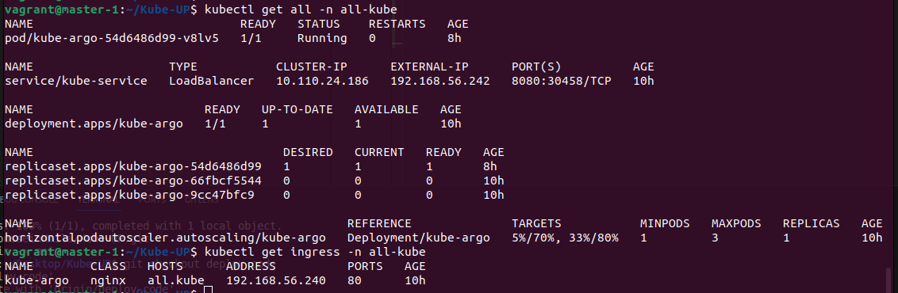
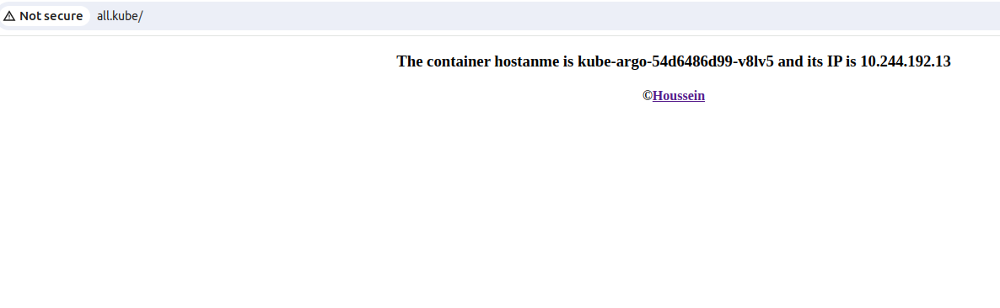
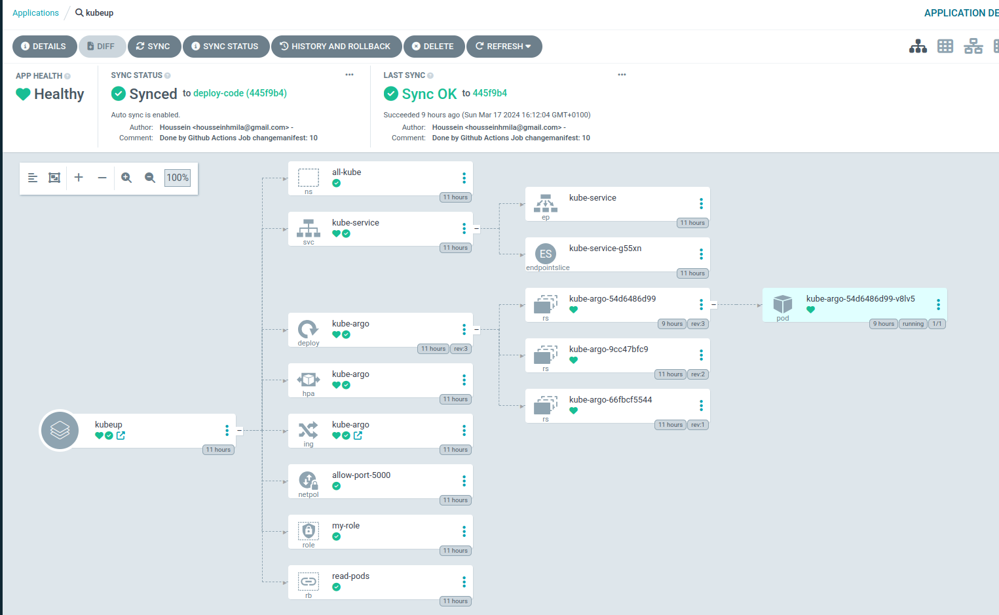

# Deploying Helm Chart

Before deploying our application, we need to configure the ingress controller. For this purpose, I've opted to use the Nginx Ingress Controller. You can find detailed installation instructions: `https://docs.nginx.com/nginx-ingress-controller/installation/installing-nic/installation-with-manifests/`

To enable the controller to function correctly, we require a load balancer service. To achieve this, we'll install MetalLB by executing the following command:


```yaml 
kubectl apply -f https://raw.githubusercontent.com/metallb/metallb/v0.14.3/config/manifests/metallb-native.yaml
```
#### MetalLB provides a network load-balancer implementation for Kubernetes clusters that do not run on a supported cloud provider, effectively allowing the usage of LoadBalancer Services within any cluster. 

Now we must configure the Metallb   using configmap object. In this configmap we give the address pool that will be used as LoadBalancer IP! Also the type of the Load Balancer.
```yaml
apiVersion: v1
kind: ConfigMap
metadata:
  namespace: metallb-system
  name: config
data:
  config: |
    address-pools:
    - name: default
      protocol: layer2
      addresses:
      - 192.168.56.240-192.168.56.250
```

Upon configuration, MetalLB will provision automatically an external IP for our LoadBalancer service.

### Cloning the Code
To get started, clone the code repository:

```bash
 git clone -b deploy-code https://github.com/HousseinHmila/Kube-UP.git 
 ```
### Installing Helm
Before proceeding, ensure Helm is installed in your cluster, especially if you're using a Debian kernel. Run the following commands:
```yaml
curl https://baltocdn.com/helm/signing.asc | gpg --dearmor | sudo tee /usr/share/keyrings/helm.gpg > /dev/null
sudo apt-get install apt-transport-https --yes
echo "deb [arch=$(dpkg --print-architecture) signed-by=/usr/share/keyrings/helm.gpg] https://baltocdn.com/helm/stable/debian/ all main" | sudo tee /etc/apt/sources.list.d/helm-stable-debian.list
sudo apt-get update
sudo apt-get install helm
```
### Deploying the Application with Helm
Now, deploy the application using Helm:
```bash
 helm install my-release ./Kube-UP/helm/
  ```

### Testing the Components
You can verify the deployed components by running:
```bash
kubectl get all -n all-kube
```



### Testing the Application: 

 we can test with two methodes:

 1. **Using LoadBalancer service:**

 ``` <loadbalancer_externalip>:8080 ```

 2. **Using ingress:**

To test the application in your browser, add your Ingress Controller's external IP to your `/etc/hosts` file on your host machine:

``` <controller_ip>   all.kube ```

Now test it on your browser:



Bingo! Everything is OK!

# ArgoCD
In this section, we will explore the role of ArgoCD.

After each commit to the app-code branch, the GitLab workflow will update the values file in the deploy-code branch. ArgoCD is listening to this branch and will attempt to synchronize our cluster based on the detected changes.



The ArgoCD application dashboard shows that our application is healthy and all components are synchronized.
It provides a visual representation of the current state of our application, allowing us to easily monitor its health and ensure that all components are in sync.
With the help of ArgoCD, we can confidently manage and deploy our application with ease.

# Conclusion

Congratulations! We have successfully completed the deployment process for your application using Helm and ArgoCD. 

Thank you for following along with this guide. If you have any questions or need further assistance, please don't hesitate to reach out.

Happy coding!
